# RickFolio Resume Platform

## Project Description
> "This isn't a boring PDF. It's an interactive resume designed to show you exactly what I can do before you even reach out."

**RickFolio** is a full-stack, role-based resume portfolio platform built by **Riccardo M. Bonato**. Instead of a static PDF, this resume lives as an interactive site managed through an admin, annotated by recruiters with comments, and publicly viewable by anyone.


---

## Project Overview

| | |
|---|---|
| **Type** | Full-Stack Web Application |
| **Architecture** | Layered (N-Tier) Architecture |
| **Containerization** | Docker + Docker Compose |

---

## System Architecture Overview

The system follows a **Layered (N-Tier) Architecture** with 4 distinct layers:

```
┌─────────────────────────────────────┐
│        Presentation Layer           │  Next.js 14 (App Router)
├─────────────────────────────────────┤
│           API Layer                 │  FastAPI + Uvicorn
├─────────────────────────────────────┤
│       Business Logic Layer          │  Services + Depends() Role Guards
├─────────────────────────────────────┤
│          Data Layer                 │  SQLAlchemy + PostgreSQL
└─────────────────────────────────────┘
```

All layers run as isolated **Docker containers** orchestrated with **Docker Compose**.

```
docker-compose.yml
├── frontend      (Next.js)     → port 3000
├── backend       (FastAPI)     → port 8000
└── db            (PostgreSQL)  → port 5432
```

### Architecture Characteristics

| Characteristic | Type | How It Is Addressed |
|---|---|---|
| Security | Explicit | JWT (HS256) + bcrypt + require_role() enforced via FastAPI Depends() on every protected endpoint |
| Maintainability | Explicit | Strict 4-layer separation - routers handle HTTP only, services handle logic, models handle data. Zero cross-layer violations confirmed by automated grep audit. |
| Simplicity | Implicit | Single quantum - one PostgreSQL database, one Docker Compose file, no distributed complexity |
| Deployability | Implicit | All services containerized with health checks and dependency ordering in docker-compose.yml |

---

## User Roles & Permissions

### Admin (Portfolio Owner)
| Permission | Access |
|---|---|
| Resume Sections | Full CRUD |
| User Accounts | Full CRUD |
| Recruiter Comments | Read + Delete |
| Admin Dashboard | Full Access |
| Contact Admin | Allowed (via contact form, no login required) |

### Recruiter (Hiring Manager)
| Permission | Access |
|---|---|
| Resume Content | Read Only |
| Own Comments | Full CRUD |
| Other Comments | Read Only |
| Admin Dashboard | No Access |
| Contact Admin | Allowed (via contact form, no login required) |

### Guest (Public Visitor)
| Permission | Access |
|---|---|
| Public Resume Page | Read Only |
| PDF Download | Allowed |
| Comments | No Access |
| Login Required | None |
| Contact Admin | Allowed (via contact form, no login required) |

---

## Technology Stack

### Frontend
- **Next.js 14**  App Router, SSR for public resume page 
- **Tailwind CSS**  Responsive, utility-first styling
- **Axios**  HTTP client with JWT interceptors

### Backend
- **FastAPI**  REST API with auto Swagger docs at `/docs`
- **Uvicorn**  ASGI server
- **python-jose**  JWT token creation and verification
- **passlib + bcrypt**  Secure password hashing
- **fastapi-mail**  Gmail SMTP email via contact form
- **Authlib + httpx**  Google OAuth 2.0 PKCE flow

### Database
- **PostgreSQL**  Relational database
- **SQLAlchemy**  ORM for models and queries

### DevOps
- **Docker**  Containerizes each service (frontend, backend, db)
- **Docker Compose** Orchestrates all containers with one command
- **Alembic**  Schema migration management

---

## Installation & Setup

### Prerequisites
- [Docker Desktop](https://www.docker.com/products/docker-desktop/) installed and running
- That's it  no need to install Node.js, Python, or PostgreSQL locally

---

### 1. Clone the repository

```bash
git clone https://github.com/RiccardoMarioBonato/RiccardoMarioBonato.github.io.git
cd RiccardoMarioBonato.github.io
```

---

### 2. Set up environment variables

```bash
cp .env.example .env
```

Fill in your `.env`:

```env
# Database
DATABASE_URL=postgresql://rickfolio:rickfolio@db:5432/rickfolio

# Auth
SECRET_KEY=your_secret_key_here
ALGORITHM=HS256
ACCESS_TOKEN_EXPIRE_MINUTES=60

# Google OAuth
GOOGLE_CLIENT_ID=your_google_client_id
GOOGLE_CLIENT_SECRET=your_google_client_secret
GOOGLE_REDIRECT_URI=http://localhost:8000/auth/google/callback
FRONTEND_URL=http://localhost:3000

# Email (Gmail SMTP)
MAIL_USERNAME=your@gmail.com
MAIL_PASSWORD=your_16_char_app_password
MAIL_FROM=your@gmail.com
MAIL_TO=your@gmail.com
```

---

### 3. Run with Docker Compose

```bash
docker-compose up --build
```

All three containers (frontend, backend, db) will start together. Database migrations run automatically on container startup.

| Service | URL |
|---|---|
| Public Resume | `http://localhost:3000` |
| Admin Dashboard | `http://localhost:3000/admin` |
| Recruiter View | `http://localhost:3000/recruiter` |
| FastAPI Swagger Docs | `http://localhost:8000/docs` |

---

### Useful Docker Commands

```bash
# Start all containers
docker-compose up

# Start in background (detached)
docker-compose up -d

# Stop all containers
docker-compose down

# Rebuild after code changes
docker-compose up --build

# View logs
docker-compose logs -f

# Access backend container shell
docker-compose exec backend bash

# Access database
docker-compose exec db psql -U postgres -d rickfolio
```

---

## How to Run the System

| Role | URL | Login Required |
|---|---|---|
| Guest | `http://localhost:3000` | No |
| Recruiter | `http://localhost:3000/login` | Yes |
| Admin | `http://localhost:3000/login` | Yes |
| API Docs | `http://localhost:8000/docs` | No |

---
## Screenshots

> Screenshots taken from the live development build.
> The system is fully functional with all three roles operational.

### Public Portfolio View 
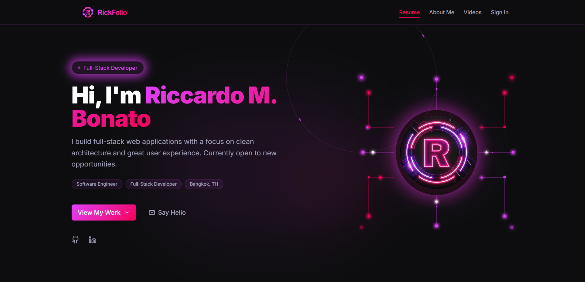
> The live resume page showing sections, project cards, and video badges - no login required.

### Login Page
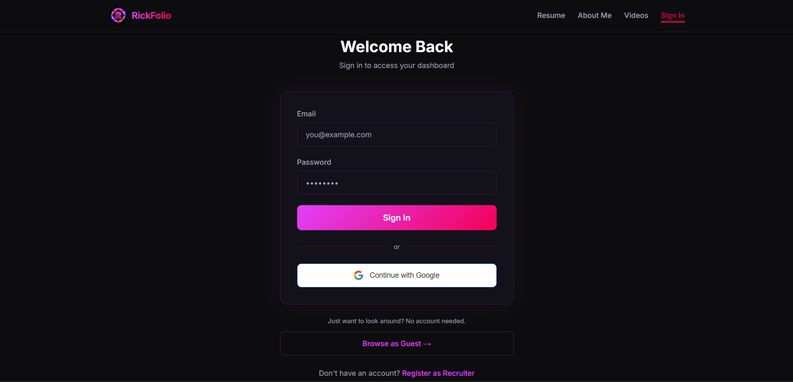
> Recruiters and admins sign in here; guests can bypass via the "View without signing in" link.

### Admin Dashboard
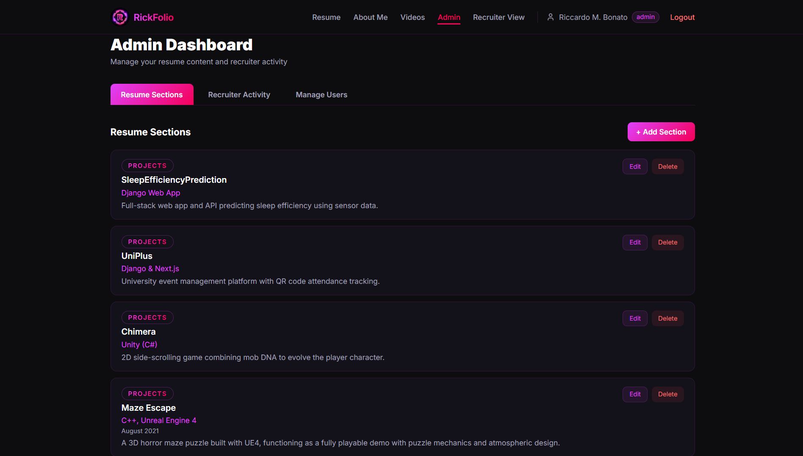
> Full CRUD over resume sections, view of recruiter comments, and user management in one place.

### Recruiter Comment View
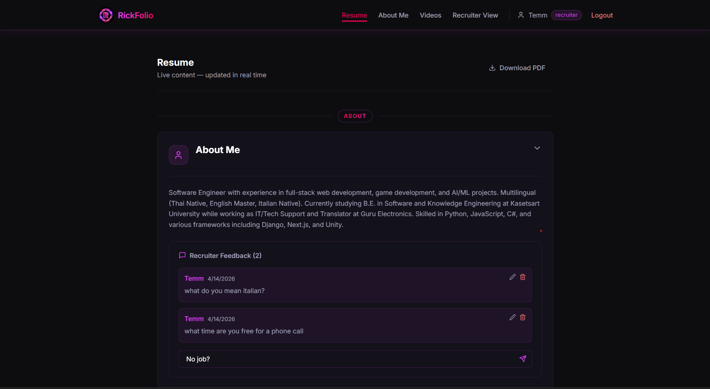
> Authenticated recruiters can expand any section and leave, edit, or delete feedback inline.

### Admin Add Section Form
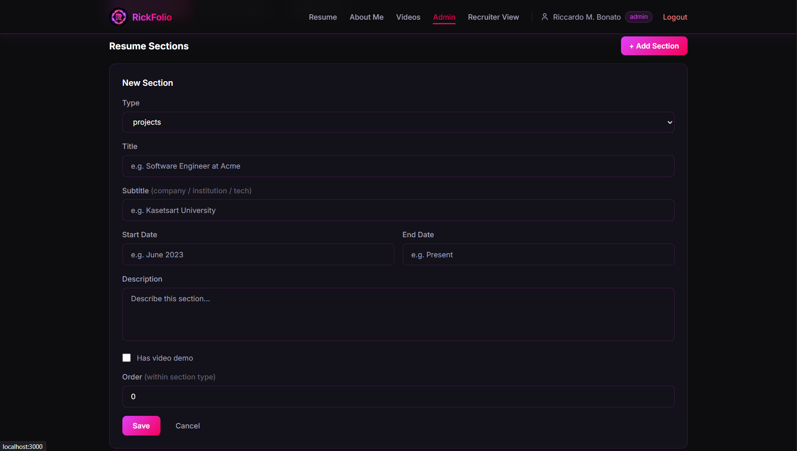
> Admin creating a new resume section with type selector, title, subtitle, dates, description, and the Has Video Demo checkbox.

### Guest Videos Page
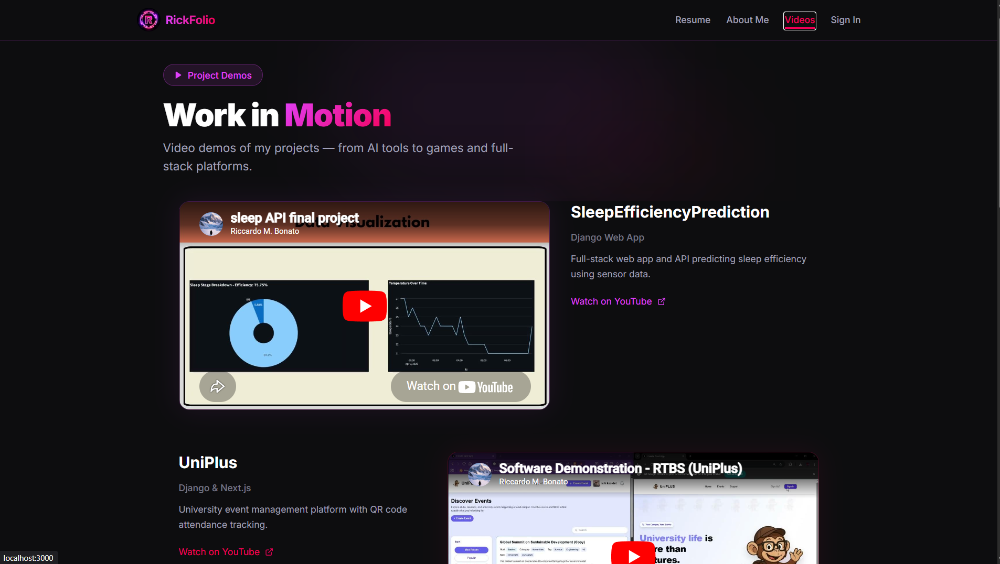
> Public videos page showing embedded YouTube demos pulled dynamically from the database — no login required.

### Recruiter Portfolio Review
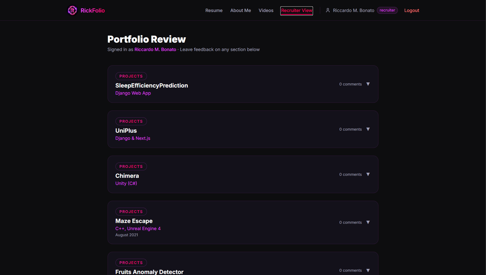
> Authenticated recruiter browsing all resume sections with comment counts and expand controls.

### About Me
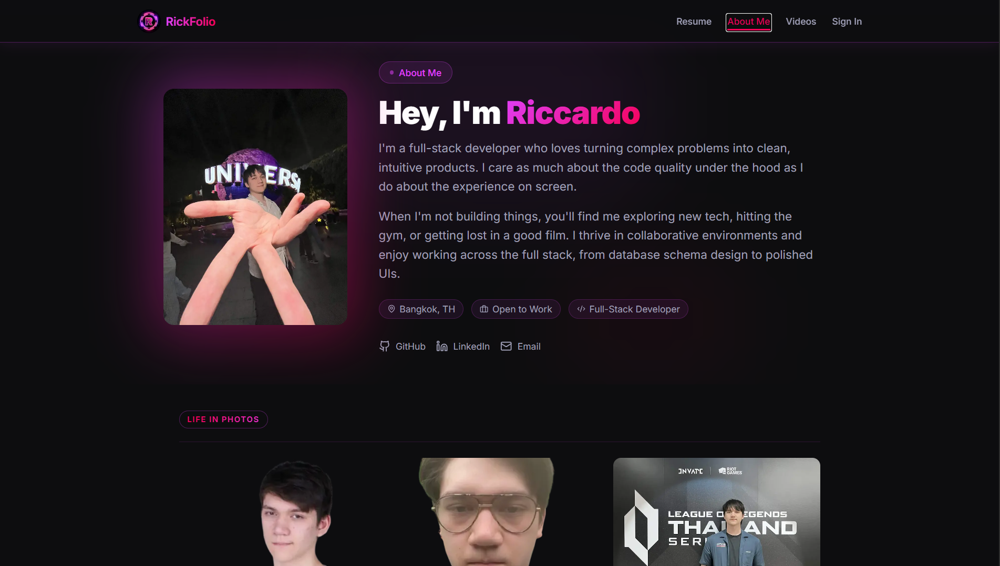
> Public About Me page showing personal bio, photo, location badges, and social links.

### About Me 2
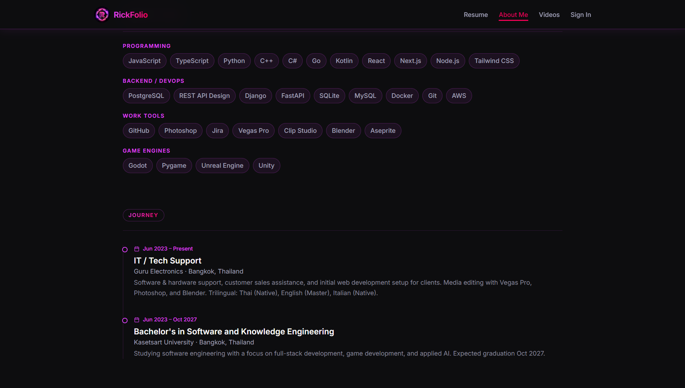
> Skills grid organized by category and a career timeline showing work experience and education.

### Email 
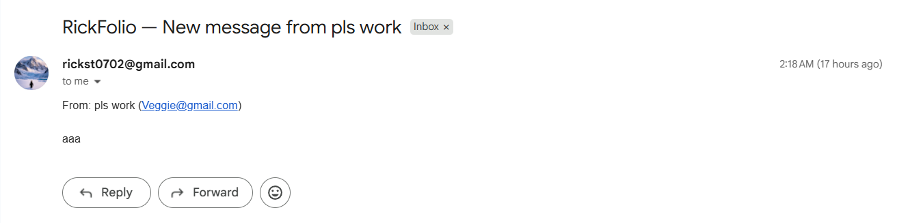
> Proof the contact form sends real emails via Gmail SMTP — message received in inbox with correct sender and subject.

### CodeCharta 
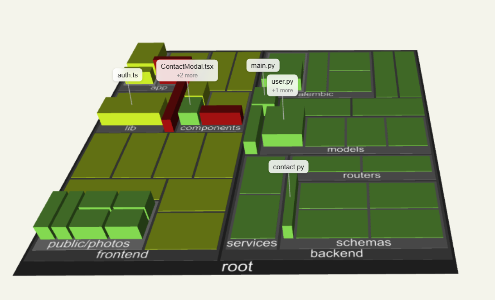
> Updated CodeCharta map showing frontend and backend structure..

## Author

**Riccardo M. Bonato**  
Student ID: 6610545502  
Software and Knowledge Engineering - Kasetsart University  
Full-Stack Developer | Bangkok, Thailand  
- GitHub: `https://github.com/RiccardoMarioBonato`  
- Email: Rickst0702@gmail.com  
- LinkedIn: linkedin.com/in/riccardo-m-bonato-65285a368
